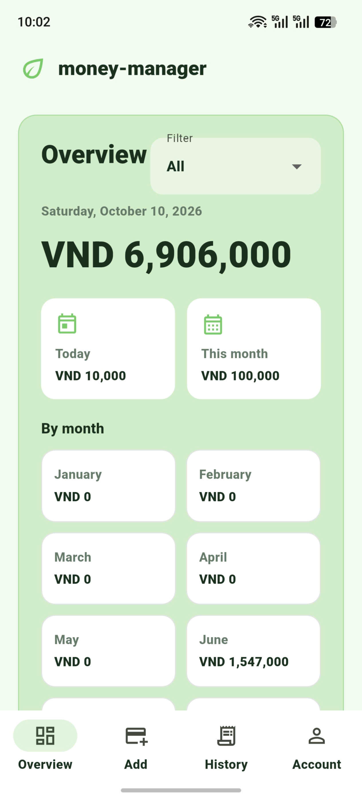
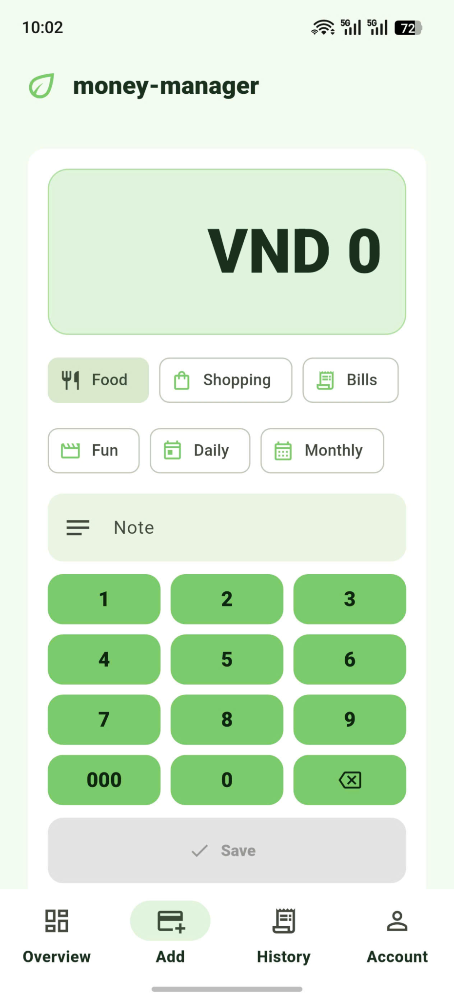
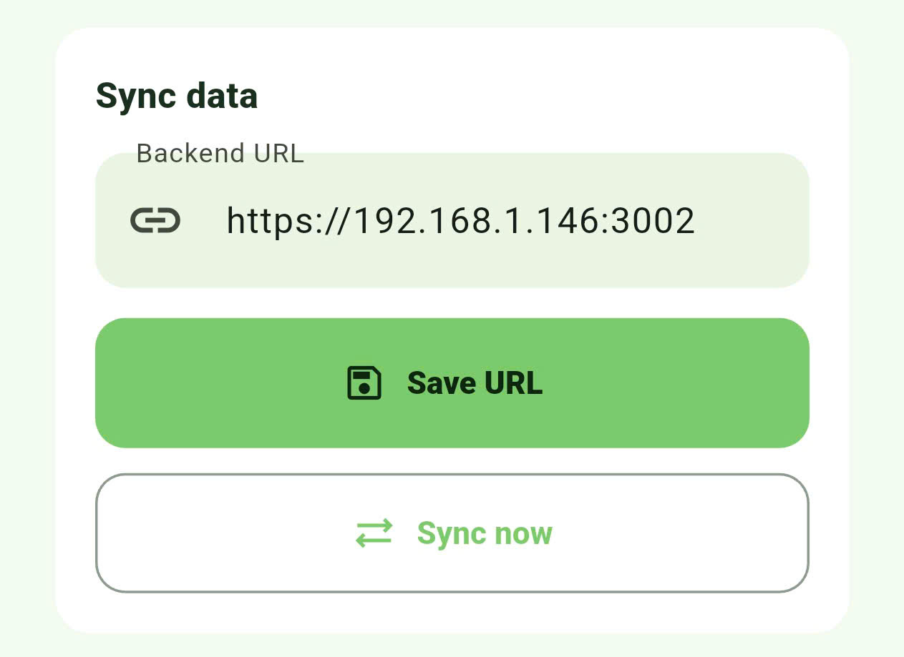

# Money Manager

**Ghi lại thu chi, nhìn rõ dòng tiền mỗi ngày.** Nhập số tiền, chọn danh mục và thêm ghi chú; xem tổng quan, tìm lại giao dịch và theo dõi các khoản chi định kỳ.

Ứng dụng Flutter cho **Android và web**, gồm bốn mục: **Overview, Add, History và Account**. Có thể dùng tài khoản local ngay trên thiết bị, hoặc chọn tài khoản đồng bộ để lưu dữ liệu qua backend riêng.

## Tổng quan

Trong **Overview**, xem số dư, thu/chi trong tháng, giao dịch gần đây và xu hướng chi tiêu. Lọc hoạt động theo **All, Expenses, Income** để xem phần cần quan tâm.

Nhìn lại các khoản đã ghi trong màn hình tổng quan

## Thêm giao dịch

Mở **Add**, nhập số tiền bằng bàn phím số lớn, chọn danh mục như **Food, Shopping, Bills, Fun** rồi thêm ghi chú và lưu. Có thể ghi thu nhập hoặc chi tiêu; khoản chi có tùy chọn lặp **Daily** hoặc **Monthly**.

Nhập nhanh số tiền, danh mục và ghi chú

## Lịch sử giao dịch

**History** nhóm giao dịch theo ngày, cho phép tìm theo tên, danh mục hoặc ghi chú và lọc thu/chi. Xóa từng giao dịch có bước xác nhận và nút **Undo** ngay sau khi xóa.

## Tài khoản và đồng bộ

Tài khoản **local** dùng được không cần backend hoặc Wi-Fi. Để đồng bộ, chọn **Use a sync account** khi đăng nhập, cấu hình máy chủ trong **Server settings**, rồi mở **Account → Sync data** để lưu **Backend URL** và chọn **Sync now**.

Lưu địa chỉ backend HTTPS và chủ động đồng bộ dữ liệu

Dữ liệu được tách riêng theo tài khoản; giao dịch của tài khoản local không tự gửi lên tài khoản đồng bộ. Account còn có giao diện sáng/tối, đổi mật khẩu, khôi phục dữ liệu cũ có xác nhận và quản lý xóa giao dịch.

Nút hình mắt trên thanh đầu trang giúp ẩn/hiện số tiền đã lưu và nhớ lựa chọn sau khi mở lại app. Số tiền đang nhập vẫn hiển thị để tránh nhập nhầm. [Xem cách bảo vệ dữ liệu và các giới hạn](SECURITY.md).

## Cập nhật ứng dụng

Trên Android, mở **Account → Check for update** để kiểm tra APK mới từ backend đã cấu hình. App kiểm tra SHA-256, package, phiên bản và chữ ký trước khi mở trình cài đặt. [Hướng dẫn phát hành qua LAN](docs/development.md#cập-nhật-ứng-dụng-và-kiểm-tra-qua-lan).

Ảnh minh họa được giữ nguyên từ phiên bản đã chụp; giao diện có thể khác phiên bản hiện tại. Số liệu và địa chỉ máy chủ trong ảnh chỉ là ví dụ; hãy dùng Backend URL HTTPS của bạn.

## Bắt đầu

- **Android:** [tạo APK và cài bản LAN](docs/development.md#tạo-apk).
- **Web và backend:** [chạy ứng dụng trên trình duyệt và cấu hình HTTPS](docs/development.md#chạy-trên-web).
- **Dữ liệu và tài khoản:** [đồng bộ, đăng xuất](docs/development.md#dữ-liệu-đồng-bộ-và-đăng-xuất) và [khôi phục mật khẩu](docs/development.md#khôi-phục-mật-khẩu).
- **Quyền riêng tư:** [báo cáo rà soát và giới hạn kiểm chứng](SECURITY.md).
