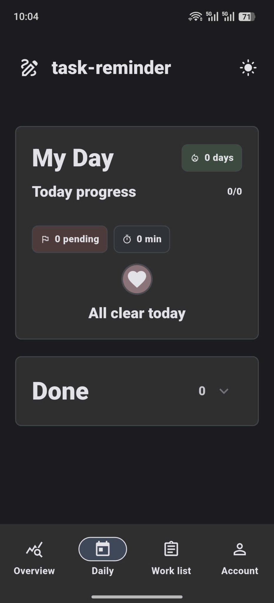
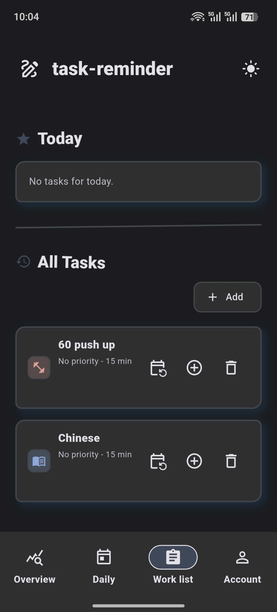
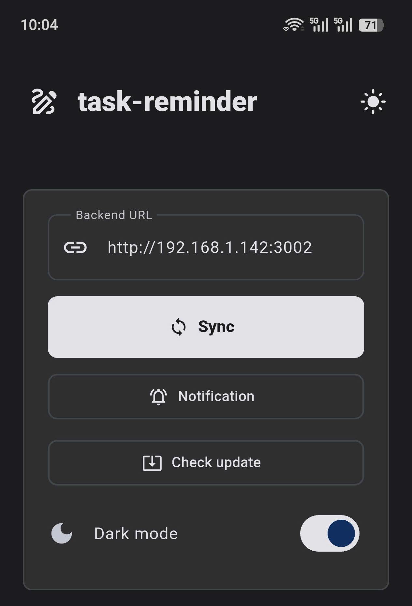

# Task Reminder

**Sắp xếp việc cần làm, theo dõi từng ngày và nhắc đúng việc.** Tạo công việc, lên lịch và nhìn lại tiến độ qua lịch tháng hoặc danh sách hôm nay.

Ứng dụng Flutter cho **Android và web**, gồm bốn mục: **Overview, Daily, Work list và Account**. Đăng ký và quản lý công việc ngay trên thiết bị; dữ liệu được tách theo tài khoản và chỉ đồng bộ khi bạn chủ động chọn **Sync**.

## Lịch tháng

**Overview** hiển thị công việc theo từng ngày trong tháng, phân biệt việc đã lên lịch và việc đã hoàn thành. Chạm vào một ngày để xem chi tiết; dùng mũi tên để chuyển tháng.

Nhìn lịch làm việc của cả tháng trong một màn hình

## Việc hôm nay

Trong **Daily → My Day**, xem tiến độ hôm nay, số việc còn lại, thời gian dự kiến cho các việc đó và chuỗi ngày có công việc hoàn thành. Đánh dấu xong, mở danh sách **Done** hoặc hoãn việc 15 phút hay sang ngày mai.

Tập trung vào hôm nay và theo dõi phần việc đã xong

## Danh sách công việc

**Work list** gồm **Today** và **All Tasks**. Thêm công việc với ghi chú, biểu tượng, mức ưu tiên và thời gian dự kiến; bấm dấu **+** để đưa vào hôm nay hoặc mở lịch để chọn ngày, thứ trong tuần và ngày trong tháng.

Tạo việc một lần, đưa vào lịch khi cần

**Smart Quick Add** nhận câu nhập nhanh như `Nộp báo cáo mai 9:30 !cao ~45p #laptop` để điền lịch, ưu tiên, thời gian và biểu tượng.

## Tài khoản, nhắc việc và đồng bộ

Trong **Account**, nhập **Backend URL** rồi chọn **Sync** để đồng bộ công việc và lịch với backend. App yêu cầu xác nhận máy chủ trước lần đồng bộ đầu tiên hoặc khi đổi máy chủ.

Quản lý kết nối, thông báo, cập nhật và giao diện

Bật **Task reminders** để nhận nhắc việc; tiêu đề công việc được ẩn trong thông báo theo mặc định, có thể bật **Show task titles** khi muốn. Account còn có đổi mật khẩu, đăng xuất và giao diện sáng/tối.

Trên Android, chọn **Check update** để kiểm tra APK từ backend đã cấu hình. App kiểm tra kích thước, SHA-256, package và phiên bản trước khi mở trình cài đặt.

Ảnh minh họa được giữ nguyên từ phiên bản đã chụp; giao diện có thể khác phiên bản hiện tại. Địa chỉ HTTP trong ảnh Account thuộc phiên bản đã chụp; bản hiện tại dùng Backend URL **HTTPS** trên Android và khi truy cập từ xa.

## Bắt đầu

- **Android:** [build APK](docs/development.md#apk-export-commands).
- **Web và backend:** [chạy bản xem trước và cấu hình kết nối](docs/development.md#web-preview-commands).
- **Cập nhật qua LAN:** [chuẩn bị APK và manifest phát hành](docs/development.md#version-update-commands).
- **Dữ liệu và quyền riêng tư:** [lưu trữ, chuyển dữ liệu](docs/development.md#where-data-is-stored) và [báo cáo rà soát](SECURITY_REVIEW.md).
