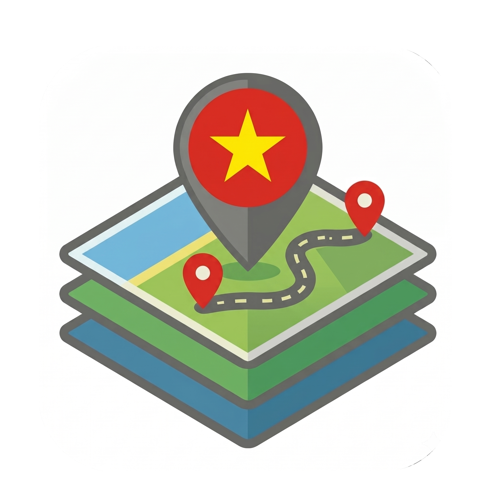
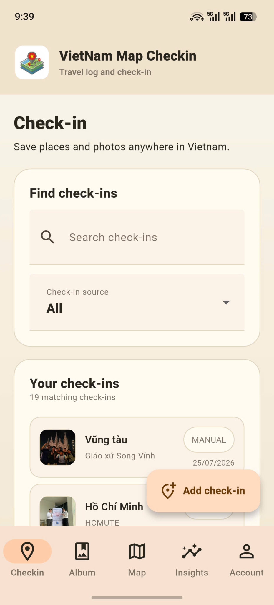
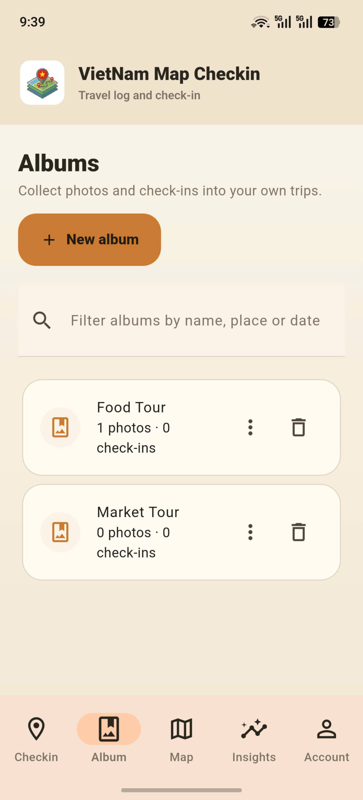
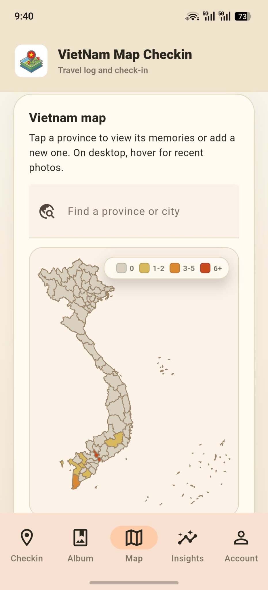
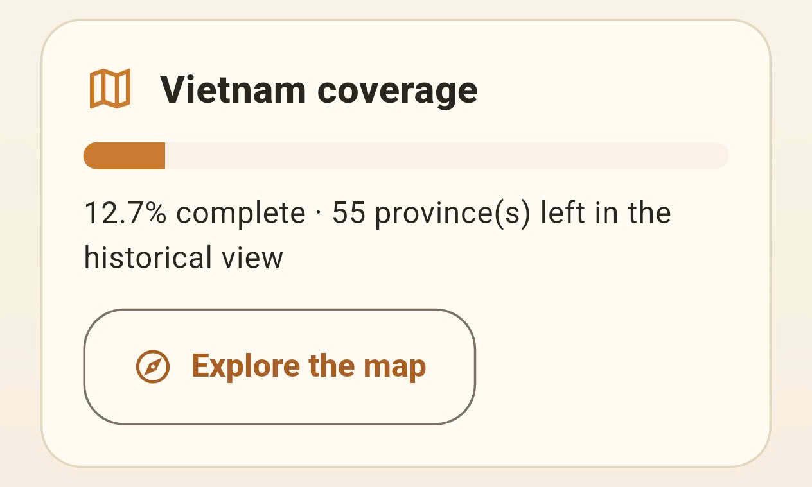
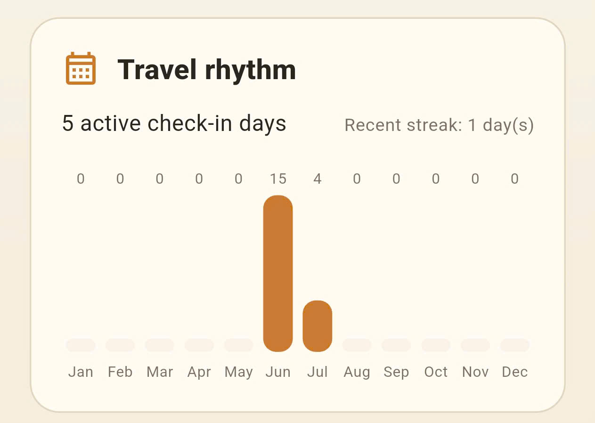
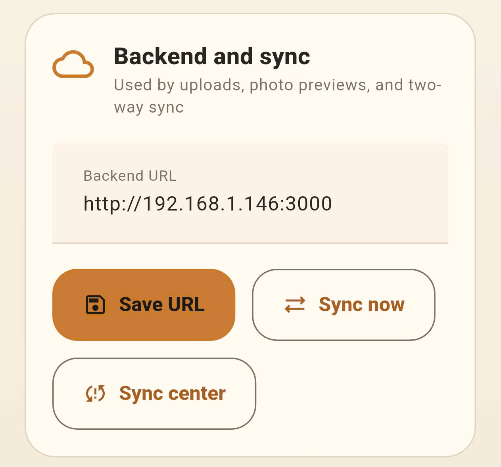
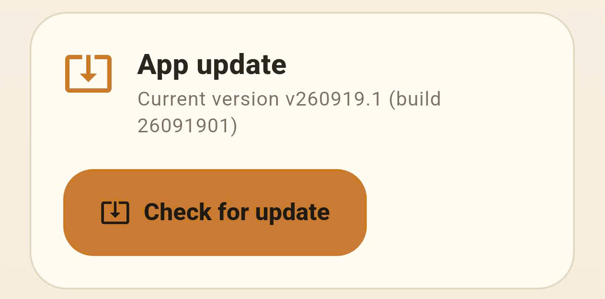

# VietNam Map Checkin

**Lưu dấu những nơi bạn đã đi qua trên bản đồ Việt Nam.** Thêm địa điểm, ảnh và ghi chú; gom kỷ niệm vào album và nhìn lại hành trình của mình qua từng tỉnh/thành.

Ứng dụng Flutter cho **Android và web**, gồm năm mục: **Checkin, Album, Map, Insights và Account**. Check-in và ảnh được lưu trên thiết bị trước, rồi đồng bộ hai chiều khi backend khả dụng. Dữ liệu được tách riêng theo tài khoản.

## Check-in

Lưu tỉnh/thành, địa điểm, ngày giờ, ghi chú và nhiều ảnh cho mỗi lần ghé thăm. Thêm địa điểm thủ công hoặc dùng GPS để tự nhận diện tỉnh/thành; tìm kiếm và lọc danh sách theo nguồn check-in.

Tìm lại kỷ niệm hoặc thêm một điểm dừng mới

## Album

Gom ảnh và check-in vào từng chuyến đi. Tạo, đổi tên và tìm album theo tên, địa điểm hoặc ngày; chọn ảnh bìa, sắp xếp ảnh và chia sẻ album dưới dạng ZIP. Xóa album không xóa check-in gốc.

Mỗi chuyến đi là một album riêng

## Bản đồ Việt Nam

Chạm vào một tỉnh/thành để xem kỷ niệm hoặc thêm check-in tại đó. Tìm nhanh địa phương bằng tên; màu sắc trên bản đồ thể hiện số check-in. Trên máy tính, rê chuột lên tỉnh/thành để xem ảnh gần đây.

Nhìn lại hành trình qua những vùng đã ghé thăm

Bản đồ và thống kê sử dụng bộ dữ liệu lịch sử **63 tỉnh/thành**.

## Thống kê hành trình

**Insights** cho biết tỷ lệ tỉnh/thành đã ghé thăm (**Vietnam coverage**), số địa phương còn lại và tiến độ theo 8 vùng. **Travel rhythm** thống kê check-in theo tháng, số ngày có check-in và chuỗi ngày liên tiếp gần đây.

  
  

Tiến độ khám phá Việt Nam · Nhịp đi của bạn qua từng tháng

Mở **Timeline** để xem các check-in được nhóm thành chuyến đi, hoặc sao chép **Travel recap** để chia sẻ bản tóm tắt hành trình.

## Tài khoản và đồng bộ

Trong **Account**, lưu **Backend URL** rồi chọn **Sync now** để đồng bộ check-in, album và ảnh. **Sync center** giúp theo dõi thao tác đang chờ, lỗi và xử lý xung đột dữ liệu.

Cấu hình máy chủ và đồng bộ khi có kết nối

Account còn có giao diện sáng/tối, đổi mật khẩu, backup mã hóa, lịch backup tự động, tùy chọn **Local only**, **Hide exact coordinates** và quản lý dung lượng ảnh. [Xem chi tiết dữ liệu và quyền riêng tư](docs/development.md#chức-năng-dữ-liệu-và-bảo-mật).

## Cập nhật ứng dụng

Mở **Account → App update → Check for update** để kiểm tra APK mới từ backend đã cấu hình. App kiểm tra SHA-256 của APK tải về trước khi chuyển cho Android cài đặt.

Kiểm tra bản cập nhật ngay trong ứng dụng Android

Địa chỉ backend, phiên bản và số liệu trong ảnh là ví dụ từ lúc chụp; hãy dùng địa chỉ máy chủ của bạn. HTTP chỉ dành cho LAN tin cậy; khi triển khai thật, cấu hình HTTPS theo [hướng dẫn backend](docs/development.md#chạy-backend).

## Bắt đầu

- **Android:** [build APK và cài đặt](docs/development.md#build-apk-android).
- **Web:** [chạy ứng dụng trên trình duyệt](docs/development.md#chạy-trên-web).
- **Backend và cập nhật LAN:** [chạy máy chủ](docs/development.md#chạy-backend) và [phát hành bản cập nhật](docs/development.md#phát-hành-bản-cập-nhật-qua-lan).
- **Quyền riêng tư:** [báo cáo rà soát và giới hạn kiểm chứng](docs/privacy-review.md).
