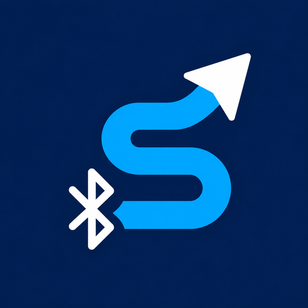
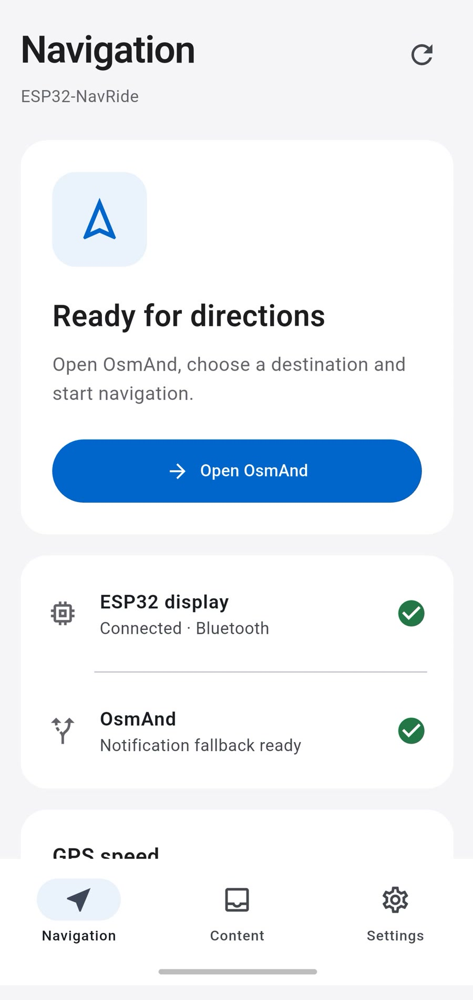
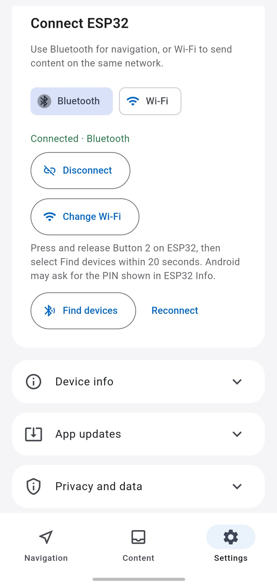
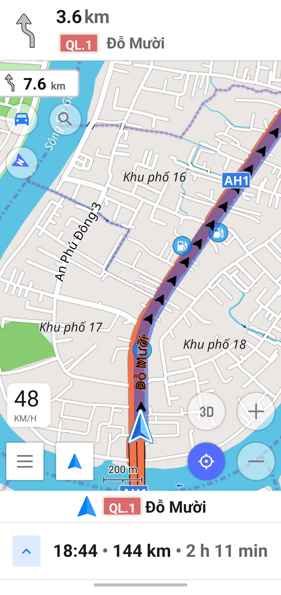
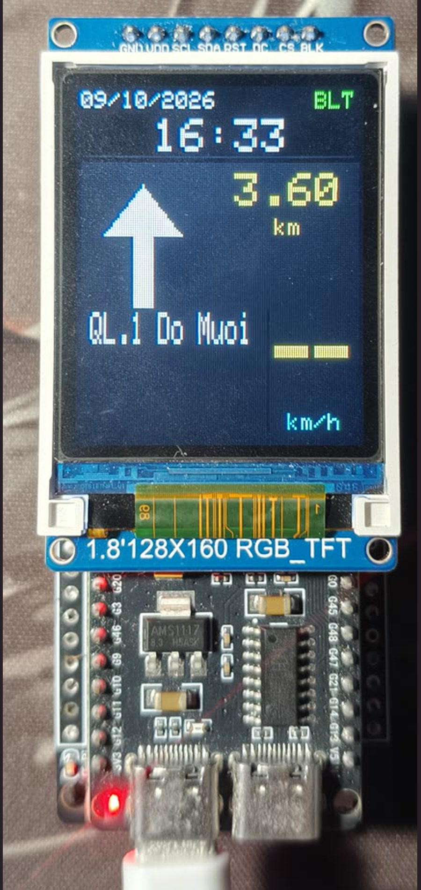
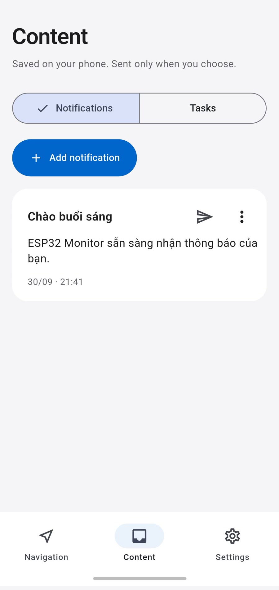
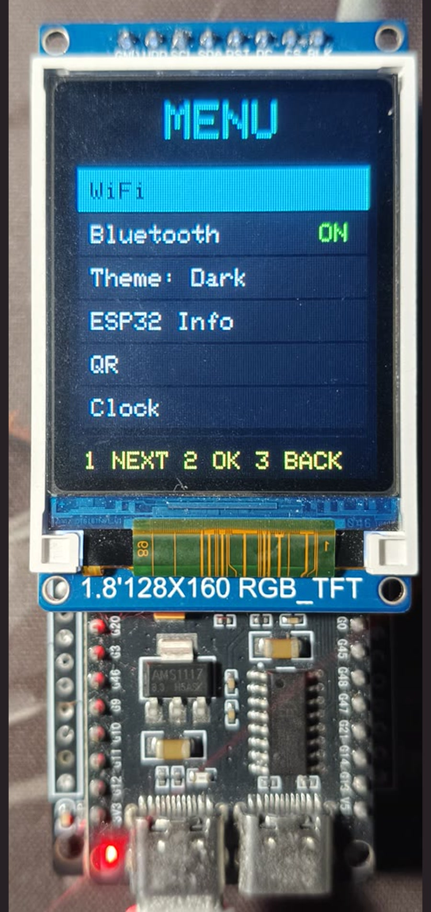
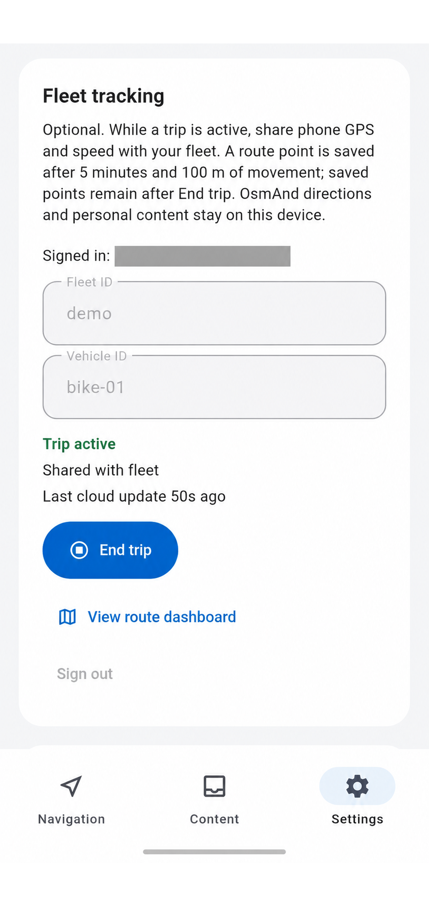

# ESP32-NavRide

**Nhìn hướng rẽ mà không cần nhìn bản đồ trên điện thoại.** OsmAnd chỉ đường, app ESP32-NavRide chuyển mũi tên, tên đường, khoảng cách và tốc độ GPS lên màn hình ESP32-S3 1,8 inch.

Điện thoại kết nối ESP32 bằng **Bluetooth** (dẫn đường không cần Wi-Fi) hoặc **Wi-Fi**. App còn gửi thông báo, việc cần làm; màn hình có đồng hồ, bấm giờ và hẹn giờ.

## Kết nối

App cho biết khi OsmAnd và ESP32 đã sẵn sàng. Chọn Bluetooth để dẫn đường không cần Wi-Fi, hoặc Wi-Fi khi điện thoại và ESP32 cùng mạng.

 

Trạng thái kết nối · Chọn Bluetooth hoặc Wi-Fi

## Dẫn đường

OsmAnd chỉ đường trên điện thoại; ESP32 hiện hướng rẽ, tên đường và khoảng cách trên màn hình nhỏ.

 

OsmAnd trên điện thoại · Hướng rẽ trên ESP32

## Thông báo và việc cần làm

Lưu nội dung trên điện thoại và gửi lên màn hình ESP32 khi bạn chọn.

## Menu trên ESP32

Dùng ba nút trên bo để mở menu, đổi kết nối, xem QR hoặc dùng đồng hồ.

## Fleet management (đang phát triển)

Khi bạn chủ động bắt đầu chuyến đi, app lưu các điểm GPS và đồng bộ với Firebase khi có mạng. Thông báo cá nhân và chỉ dẫn OsmAnd không được đưa lên Fleet.

[Xem lịch sử chuyến đi trên dashboard](https://navride-96851.web.app) (cần tài khoản được cấp quyền).

## Bắt đầu

- **App Android:** mã nguồn và cách cài/build APK ở [App/](App/README.md). APK cũ trong repo thuộc package ID cũ; để dùng Firebase, hãy build app hiện tại theo hướng dẫn.
- **Firmware ESP32-S3:** mã nguồn, sơ đồ dây và cách nạp bằng PlatformIO ở [Firmware/](Firmware/README.md).
- **OsmAnd:** cài trên điện thoại, tải bản đồ, bật tích hợp ESP32-NavRide rồi bắt đầu dẫn đường. [Các bước kết nối](App/README.md).

Chỉ dùng màn hình phụ khi điều khiển xe an toàn; hãy thiết lập app và ESP32 khi xe đã dừng.
